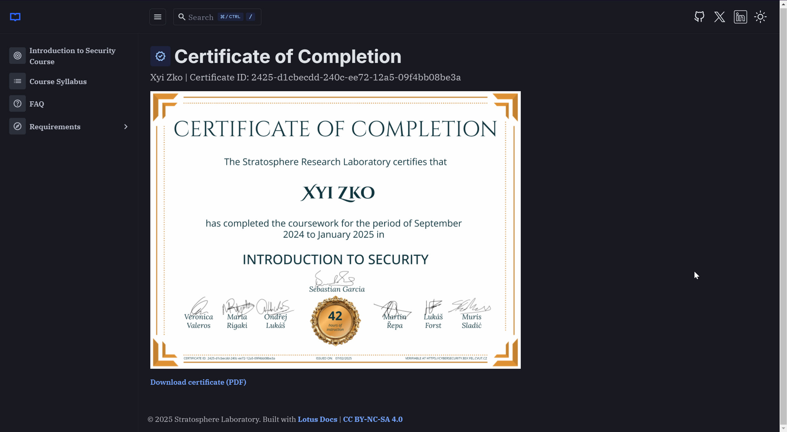

<h1 align="center"><code>xo-h-stratocyberlab</code></h1>
<h2 align="center"><i>Work for startocyberlab</i></h2>

---

1. [What ?](#what-)
2. [Dirs](#dirs)

---

# What ?

1. This repo will contain the work for [`stratocyberlab`](https://github.com/stratosphereips/stratocyberlab) which is part of [`Intro to CyberSecurity - Czech Technical University in Prague. `](https://cybersecurity.bsy.fel.cvut.cz/) course. Coursework and related will be done here
2. The actual cyberange and all related notes will be in its own directory.

# Dirs

Description of the dirs that are found in this repository.
